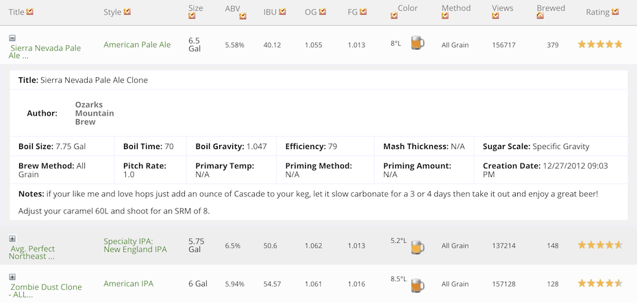
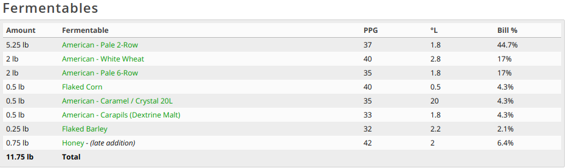
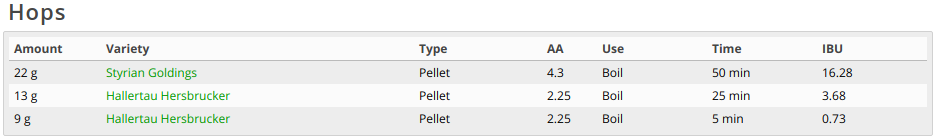
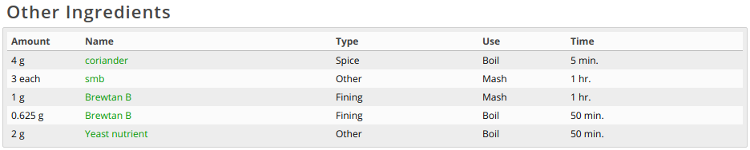
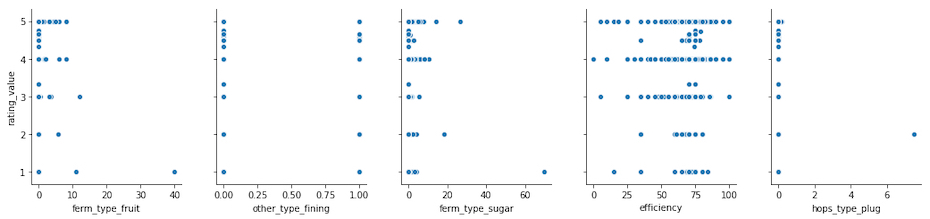
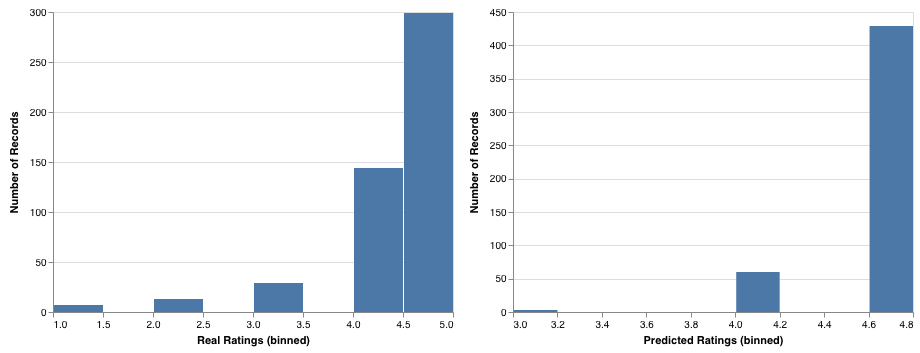

# Introduction & Related Work
Homebrewing has a long and storied history, stretching back thousands of years, and embraced by people in the lab and garage alike. There are many different approaches, starting points, and strategies, but it all boils down to taking an unfermented grain derivative and turning it into beer (as if, as was previously thought, by magic). As it turns out, this is a rather complicated undertaking, and there are many communities devoted to figuring out how to brew good beer. These communities can be found everywhere from the university, to the dive bar, and the pursuit of brewing perfection pervades research papers as much as online forums.

Chemists seem especially drawn to brewing, since, unlike most industrial fermentation processes designed to produce one thing in quantity which is then extracted and purified, beer is itself both the process and the final product - all the byproducts are a necessary part of the beer [@geeramirez1994]. These chemists came up with a series of mathematical models to predict the growth of yeast and existence of extra flavor compounds such as fusel alcohols and esters in beer. Their models were far more rigorous than previous attempts, and continue to be cited today. They are imperfect, however, and don’t account for everything which can lead to off flavors - in fact, the science behind brewing good beer is incomplete, and new discoveries continue to be made [@olaniran2017]. The aforementioned necessity of by-products in beer and their tenuous relationship with the pallet are responsible for this complexity. For example, according to Olaniran et al. [@olaniran2017], Isoamyl - which is a higher alcohol produced by yeast as part of the brewing process - is a sought after compound in beer due to its “heavy” effect on taste, but it leads to off flavors if it exceeds “20% of the total amount of n-propanol, isobutyl alcohol and isoamyl alcohol.” Many such balancing acts exist within the brewing process, and the difficulty they impart is exacerbated by the relatively few knobs and dials a brewer has at their disposal.

A brewer bears more resemblance to a zookeeper than a cook, as their most important job is to keep the yeast happy, healthy, and entertained with the proper substances. Since the yeast is doing all the real work - eating, excreting, and eventually lying dormant at the bottom of a bottle (in this they bear a striking resemblance to the human race) - and since the balance of what they produce and for how long can be impacted by just about everything going on in the wort, every minor tweak to process or ingredient has a cascading effect throughout the beer. Even measuring properties like off flavors is a feat unknown to the bucket-brewer, requiring esoteric knowledge and equipment to even attempt. Marsili et al. [@marsili2007] make note that “Beer contains dozens of odor active chemical components in concentrations ranging from percent to parts-per-trillion (ppt)“ as they propose a new method of quantitatively measuring off flavors in beer. Because the typical homebrewer cannot be expected to measure variation in compounds which are described in ppt, or understand the inner workings of a polydimethylsiloxane extraction, they are restricted to highly subjective qualitative analysis. Such analysis usually takes the form of “this tastes good,” or “this tastes like the inside of a shoe,” which is not especially useful except when taken in aggregate.

As mentioned previously, a brewer has at their fingertips a number of knobs and dials, each of which has a multitude inscrutable, overlapping effects on the final product. These include standardized parameters and measures of the brewing process (such as boil time, original gravity (OG), final gravity (FG), chill method, pitch rate, hopping method, etc.) as well as the ingredients (attenuation, flocculation, yeast type, alpha acid units (AAU’s), hop type, etc.). We propose using these parameters to create a model capable of predicting the final quality of a beer. In doing so we hope to glean some insight into what aspects of the brewing process are most important to the final quality. Since it is almost as difficult to quantitatively assess the quality of the beer (which we define here as the absence of off flavors), we will be using aggregate recipe ratings sourced from a popular homebrew website as our metric. In this way we hope to find out if beer popularity can be predicted using quantifiable features of a recipe, and if so, provide a utility that homebrewers can use to get an idea of how good a recipe might turn out before devoting the time and money required to brew it.

# Methods

## Dataset

All of our data was scraped from brewersfriend.com, a website dedicated to sharing and rating homebrew recipes. Anyone can add or vote on a recipe, and the available recipes are not curated. We had to scrape 5000+ pages of beer recipes formatted in HTML tables. Each page had 20 beer recipes, which resulted in over 100,000 beer recipes that needed to be scrapped. 

In order to gather sufficient information (beer ratings, ingredients used, etc) for each beer recipe, we had to scrape a detailed page of that recipe. This resulted in over 100,000 requests. Our first attempt at this was just to iterate through a list of links in order to scrape the information on that page. This soon proved to be cumbersome as the variance in HTML formatting resulted in unhandled edge cases that would interrupt our process. You can imagine how frustrating this can be when we’ve iterated over a couple thousand links, just to have it error out. After carefully revisiting our script to ensure that we accounted for all cases (or at least tried to), we still had the issue of long wait times (~16 hours to scrape 100,000+ links). This was not scalable and restricted us from actually being able to explore our data in attempt to capture some relationship. As a result, we had to utilize multiprocessing in order to scrape on separate processes. This proved to be effective as it shaved down our overall scraping time by a factor of 5 (~3 hours to scrape 100,000+ links).

## Feature Abstraction and Engineering

The final structure of the dataframe varied in some ways from the data on Brewers Friend. Many of the variables we wanted to train our model on were not readily quantifiable. In order to represent this data, we addressed each recipe component in turn and came up with a way to incorporate it into our dataframe.

The Fermentables section lists the many substances which make up the majority of the mash. These substances provide the yeast with sugar, which it turns into ethanol, carbon dioxide, and a number of other by-products.

There were too many different ingredients to track all of them, but each ingredient had an associated type. We decided the best way to capture differences between recipe fermentables was to create a variable for each different type of fermentable, e.g. crystal malt, extract, and fruit. We then assigned the value of the combined weight of every fermentable in that category to the variable representing that category - if a recipe called for 2 lbs of Pale 2-Row and 3 lbs of White Wheat (both of which are base malts), the base malt variable for that row would be 5 lbs. By tracking the weight of fermentables in each category, we are able to look at the ratios between each fermentable category while getting rid of the substantial categorical bloat that would come from tracking each individual fermentable name.

The hops category contains pertinent information on alpha acids, hop use, and boil time, as well as which hops and how many to use. Hops lend a beer its bitterness and aroma, and are an important part of the final product. 

All of the hop statistics, such as AA’s, hop use, and boil time are are accounted for in a Beer’s IBU calculation. Because of this, we elected not to include them, and instead use IBUs in their place. We did, however, track the type of hop used (full, pellet, plug), because it could have an impact on the final beer quality. Hop type was tracked in the same manner as fermentables, using a different variable for each type measured in weight.

The other ingredients section listed all the extra ingredients contained within the recipe, which varied by type. There are many different ingredient types and uses, and the section functions as a catch-all location to specify non-standard ingredients. 

Instead of creating a categorical variable for each different ingredient, we made a new variable for each type of ingredient, and assigned it 1 or 0 depending on whether the recipe contained an ingredient of that type. If a recipe contained any amount of, say, spices, the spices variable read exactly 1. Notice that unlike fermentables and hops, these variables did not take into account the weight of ingredients in a certain category. This is due to the catch-all-nature of other ingredients. A single ounce of vanilla extract will have a much larger impact on the flavor of a beer than an ounce of ginger since it is a far stronger spice. Both of these would register as an ounce of spice, but mean different things. Therefore, we abstracted out amount, because it would only serve to confuse our model.

## Picking Features

In addition to the features we engineered above, we also included a number of variables which were already readily available on the website. These, their descriptions, and their justification for inclusion are as follows:

* The outcome of interest
  * Rating value - the aggregate review for a recipe
* The following are measurable, standardized attributes of a recipe, and are therefore perfect for training our model
  * ABV - the alcohol by volume of the beer
  * IBU - International Bittering Units, a measure of hoppiness
  * Gravity difference - the difference between original and final gravity, an indicator of how much a beer has fermented
  * Method - the general workflow followed to make the beer, how “from scratch” the recipe is
  * Boil time - how long the beer is boiled for
  * Efficiency - beer mash extraction efficiency - extracting sugars from the grain during mash
* We chose to include the weight of fermentables in each category because it provides a layer of abstraction over individual ingredients, but still allows our model to train on the ratio of one fermentable to another - an important factor in a homebrew recipe
  * Total weight of fermentables - total fermentables ingredient weight
  * Base malt weight - total weight of base malt fermentables
  * Crystal malt weight - total weight of crystal malt fermentables
  * Roasted malt weight - total weight of roasted malt fermentables
  * Other fermentables weight - total weight of other fermentables
  * Extract weight - total weight of extract fermentables
  * Sugar weight - total weight of sugar fermentables
  * Raw fermentables weight - total weight of raw fermentables
  * Acidulated malt weight - total weight of acidulated malt fermentables
  * Fruit fermentables weight - total weight of fruit fermentables
  * Gluten free malt weight - total weight of gluten free malt fermentables
* The weight of hops of each type was included because, although the other hop attributes are included in the IBU calculation, it does not capture the hop type
  * Pellet hops weight - the weight of pellet hops used
  * Whole hops weight - the weight of whole hops used
  * Plug hops weight - the weight of plug hops used
* We included a feature for each type of other ingredient because they can have an otherwise unexplainable impact on a beer
  * Spice - whether the recipe contains added spices
  * Water agent - whether the recipe contains added water agents
  * Other - whether the recipe contains other (non-standard) ingredients
  * Fining - whether the recipe contains added finings
  * Flavor - whether the recipe contains added flavors
  * Herbs - whether the recipe contains added herbs
* Yeast is an immensely important attribute of beer brewing, so we included the following standard attributes
  * Yeast form - whether the yeast was liquid or dry
  * Attenuation - the attenuation rate of the yeast
  * Flocculation - the flocculation rate of the yeast
  
## Trends
To find if certain features were more related to helping predict rating values we ran a pearson correlation between rating values and all the other features. What we discovered was that there was some correlation between certain attributes and rating values but not too much. Ferm_type_fruit had an R^2 of 0.111 and other_type_fining had an R^2 of 0.109. Therefore, we made sure to include these and a few other features to build our model before refining it.

## Outliers 
The data that we are using for this project was scraped from a website where all the requirements to submit a recipe or data is making an account. This fact along with the fact that there are more than 100,000 data points, there is bound to be a lack of data integrity. For example, the average IBU for all recipes is 34.76, however the largest data point is 3583.81 and the average OG for all recipes is 1.057, however the largest data point is 50.02. This would skew our predictive model a lot if we included all these outlying data points. To account for this the first thing we did was remove all the rows without a rating value. This helped reduce many outliers since recipes that were made with extreme amounts of a certain attribute or produced a severe outlier were probably never made or rated by other users. 

## Formatting the Data
Our data was, of course, not in a form conducive to training our model right away, so it underwent a number of preparative transformations. Each of the csv’s the scraper produced had to be combined into a single feature csv, and a single outcome csv. Every weight in the dataframe was converted to pounds to make comparison easier.

## Dealing with NA Values
After these transformations, we dropped every row without a rating. These could not be used to train our model, since they did not have an outcome, and were therefore useless to our analysis. We had about 2000 rows after this operation, and most of the NA’s had been eliminated. Excluding yeast information, each NA existed in a column we did not wish to keep in the final dataset (one that was not present in the above feature list). There were 12 rows containing NA’s for yeast information, so we dropped those rows from the dataset.

## Pipeline Construction 
In order to train and test our models, we assembled an sklearn pipeline using the following common parameters. Each model we created used a 75-25% train-test split, and was cross validated across 10 different shuffled folds. Each feature was normalized to a scale between 0 and 1 to allow the models to train on them.

## Training
Our outcome of interest was the aggregate rating for a given recipe. This rating was derived from the average of all reviews submitted for a given beer. Initially we considered this rating value as a continuous variable since the ratings for recipes were between 0 and 5 with an accuracy of two decimals. With that in mind we decided to used generalized regression models. Since we had such a large dataset with more than 30 features we decided to use SVR and Ridge regressions as well as a Neural Network Regressor. We ran grid search on all of these models to select the best parameters and fine tune the model. Unfortunately, each model resulted in a very poor accuracy score. 

Each individual review was categorical, being one of 1, 2, 3, 4, or 5 stars. Because of this, we eventually decided to use a classifier to predict results instead of a regressor. In order to classify our outcome, we rounded each review score to the nearest 0.25 increment. This allowed us to achieve a middle ground between the categorical nature of the individual reviews, and the continuous nature of the aggregate. The classifiers attempted were KNN and a multilayer perceptron neural network.

# Results

## Initial Models
Ridge regression gave us a score of 0.02% while SVR fit such a poor model that we received a negative score. The Neural Net Regression yielded an accuracy of 3%, and our best models, random forest and XGBoost regressor, both got 10% accuracy.

Following the decision to transform our outcome variable into a categorical variable, we rounded the rating value to the nearest fourth. For example, 4.14 would be rounded to 4.25. This meant that we broke up the scale of 0 to 5 into 20 even categories. Once this was done, we decided to use classifier models to try to predict the category the ratings belonged in, instead of a continuous number. We initially used a KNN classifier, which resulted in a 53.05% score - a massive improvement which led us to our final model with newfound confidence.

## Final Model
Our final model was a Neural Network Classifier, which achieved a 58.54% accuracy using the following hyperparameters selected through grid search:

  * Hidden_layer_sizes - 100
  * Activation - relu
  * Solver - adam
  * Alpha - 0.001
  * Learning_rate - constant
  * Random_state - 42
  * Beta_1 - 0.07
  * Beta_2 - 0.999
  * Early_stopping - False

We had a 60.50% score in the beginning, but after investigating the results we realized the model was only ever predicting 5.0, regardless of input features. This was due to the prevalence of high scores in our outcomes, so we changed the activation from logistic to relu, and increased hidden layer size from 10 to 100. After these changes our predictive score went down 2%, but we were predicting a much broader spectrum of scores, so we elected to use this model.

## Analysis
Even though a neural net is something of a black box when it comes to determining which features had an impact on the score, we can say with confidence that the quantifiable features of a homebrew recipe have a measurable effect on a beer’s popularity. The 58.54% accuracy we arrived at is not ideal, but it’s more accurate than a coin flip, and allows us to put some confidence in the model. Thus, the answer to our research question, "Do quantifiable attributes of a homebrew recipe (such as fermentables, hop type, etc.) influence a beer’s popularity?", is a tentative "yes".

That said, the predictive model proves itself to be overfit to the data. Looking at the distributions for actual vs. predicted scores below, we see that the model is still heavily distributed towards predicting a score of 5.

As is the nature of nerual networks, this is fundamentally a problem of too little data - a problem that in this situation is very difficult to overcome. Scraping brewersfriend.com for recipes provided us an incredible 100,000 rows, however only about 2,000 of them had actual ratings associated with them. Among these rated recipes, the distribution of ratings was very high - the large majority of ratings being 4 or 5 stars. This uneven distribution means that our neural network simply does not have enough 1, 2, and 3 star recipes to accuraley train on. Further, the complexity and time required to test homebrew recipes and provide ratings for ourselves is prohibitivley high. Expanding and improving upon this model would likely require creatively scraping and combining ratings from other sites, or simply waiting for more recipes to be rated over time.

# Discussion
There are several different use cases and implications from our research and project. The homebrewing field is rapidly growing and many people from around the world are approaching this new hobby. Currently there are numerous articles, tutorials and videos on getting started. However, there is a lack of information regarding the specific features that go into developing a great brew. A lot of the advice found on the internet or through friends suggests playing around with and using the trial and error method to find good combinations. We sought out to take a scientific approach and therefore developed this model and tool. Our goal from the start was to make the area of homebrewing easily accessible and open it up to everyone. 

The domain of crafting original homebrews, however, is niche and not many people are aware of the complexity behind brewing a good brew or ale at home. Even people who are experienced in brewing at home have to spend enormous amounts of time playing around with the ratios of different features such as original and final gravity, fermentation types and weights of hops to produce the best possible outcome. We believe our model and online resource helps experts try out different combinations of features before spending time, money and effort in brewing something they possibly will not like. 

In addition to helping experts we hope our tool and insights can make the activity of homebrewing easier to approach and try out. It can be used by novices who intend on getting into the hobby. Understanding the features and the effect of differing ratios on the final result can greatly decrease the initial learning curve. 

# Future Work
Our model and online resources are a great place to start and have a range of impacts. However, we understand the taste of ales is highly subjective. Not only in that some consumers might enjoy a homebrew and rate it five stars while other might detest it and rate if much lower, but also in that any two consumers may have very different standards for what constitutes a certain rating. Due to the high levels of subjectivity involved in an area like beers and ales we should consider how we can tailor the ratings to the needs of the customers. 

One way we could approach this in the future is ask customers about their taste preferences before letting them play around with our online tool. By collecting data points on their likes and dislikes pertaining to ABV, fermentation types and other features. We can change our predictive model to recommend (give higher ratings) to beers and ales that are similar to ones they already like. To further build upon and improve our predictive machine learning model we can initially take two simple yet effective steps. The first one is increase the amount of data fed into training our model. This would improve the accuracy score from the current 58%. An issue with this could be that we overfit our model; however, since most of our data is restricted within a strict range it is unlikely this would be an issue. 

The second step we could take is increase the number of features that we train our model on. Currently, we narrowed our features from more than 60 to about 30. However, by including more features the model can possibly increase its predictive power. With this we can also think about how the ratios of different features play a role in determining the final outcome. It is significant to note that many of these features are codependent in that the the rating of a homebrew depends on the ratio and balance of two or more features in our data. An approach to practically solving this could be, users select the features they want set and then our model helps recommends quantities of other attributes to achieve the best result. 

We believe our machine learning model is a good first step to helping people gain an understanding of home brewing. With the improvements described above, this tool can be transformed into a resource that more completely encompasses the complexities of this domain. 

# References

---
references:
- id: geeramirez1994
  title: A FLAVOUR MODEL FOR BEER FERMENTATION
  author: 
  - family: Gee
    given: Douglas A
  - family: Ramirez
    given: W.Fred
  type: article-journal
  URL: 'https://doi.org/10.1002/j.2050-0416.1994.tb00830.x'
  DOI: 10.1002/j.2050-0416.1994.tb00830.x
  publisher: The Institute of Brewing & Distilling
  issued:
    year: 1994
    month: 9
    
- id: marsili2007
  title: Evaluation of PDMS-Based Extraction Techniques and GC-TOFMS for the Analysis of Off-Flavor Chemicals in Beer
  author: 
  - family: Marsili
    given: R.T.
  - family: Laskonis
    given: L.C
  - family: Kenaan
    given: C
  type: article-journal
  URL: 'https://www.tandfonline.com/doi/abs/10.1094/ASBCJ-2007-0617-01'
  DOI: 10.1094/ASBCJ-2007-0617-01
  publisher: Journal of the American Society of Brewing Chemists
  issued:
    year: 2007
    month: 1
    
- id: olaniran2017
  title: "Flavour‐active volatile compounds in beer: production, regulation and control"
  author: 
  - family: Olaniran
    given: Ademola O.
  - family: Hiralal
    given: Lettisha
  - family: Mokoena
    given: Mduduzi P.
  - family: Pillay
    given: Balakrishna
  type: article-journal
  URL: 'https://doi.org/10.1002/jib.389'
  DOI: 10.1002/jib.389
  publisher: The Institute of Brewing & Distilling
  issued:
    year: 2017
    month: 3
...